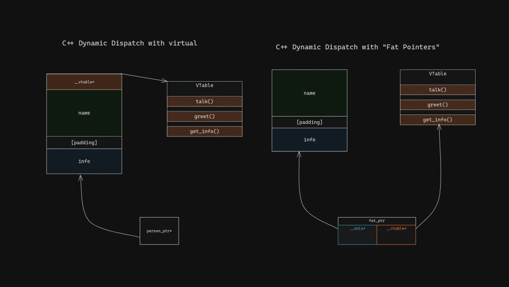

# Interfacer: Create Interfaces using THICC Pointers in C++

Tired of `virtual` and its gross hidden `__vtable` pointer? Do you want
something more akin to Rust's `as &dyn <trait>`? Need more control of your
vtables? Are you tired of using filthy inheritance to achieve your goals? This
is probably for you. Interfacer is a simple code generation tool that creates
"fat pointer" interfaces from YAML files. It also generates a helper
`make_interfacename` function to make it easy to integrate it to your code, but
you still can specify your own vtables just fine.



## Usage

> NOTE: Requires C++14 or later, ideally you should use C++17 or later as it
> can take advantage of better `constexpr`

### Simple concrete type (Allocator)

```yaml
# Interface name
Allocator:
  # List of Methods, first element of each method must be its return type,
  # followed by key-value pairs of identifier and type
  - alloc:
    - void*
    - nbytes: int

  - free:
    - void
    - ptr: void*

  # Start a method name with + to mark it const
  - +full:
    - bool
```

### Generic container type (List)
```yaml
# A List of type T is any container that has an indexing and a length method.

List:
  # Template arguments are declared similar to methods
  template:
    - T: typename

  at:
    - T&
    - idx: int

  +len:
    - int

```

## Limitations

Because this is mainly a hack you can expect a bunch of edge cases, as
Interfacer does not parse C++ code, and never will as doing so is insanely
complicated and you're better off just using a good language.

Because interfaces are just plain function pointer tables, you cannot add
procedure overloading to interfaces, as that would require Interfacer using its
own name mangling rules that would create even *more* problems. You **can**
however, choose a specific overload of a function to be in the vtable, you can
just copy-paste the wrapper and do a specialization for your datatype where you
change the desired vtable fields.

> NOTE: Vtables must be `static`, as they will live through the whole program,
> you could make some heap-allocated (potentially mutable) vtable if you're
> insane tho.

